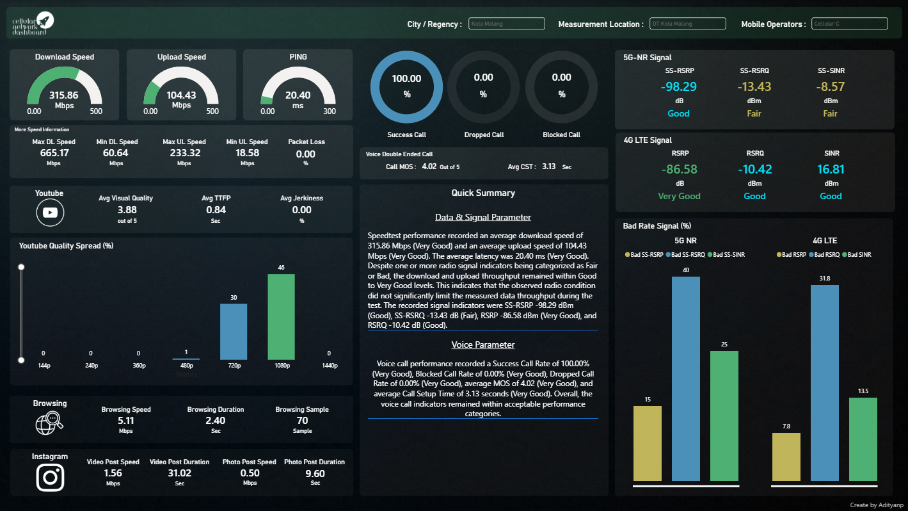
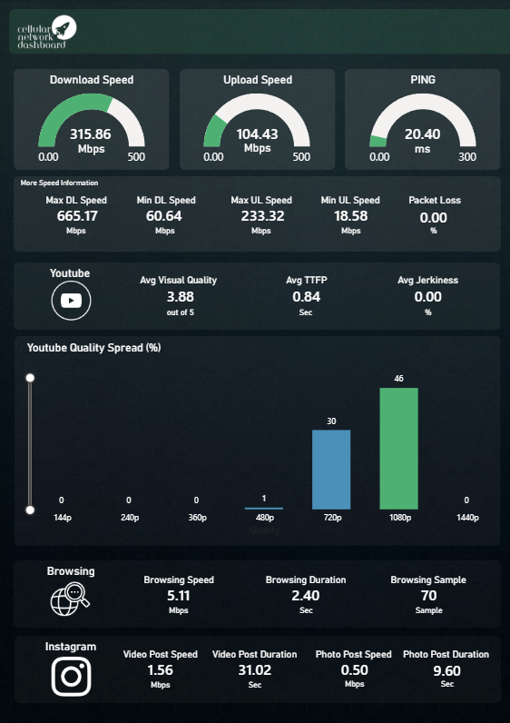
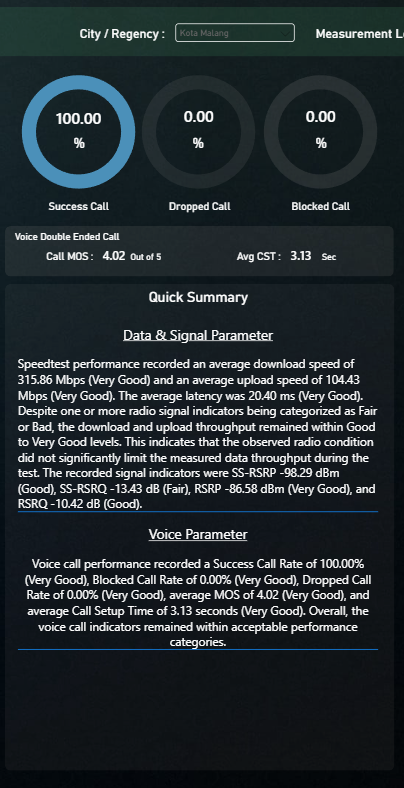
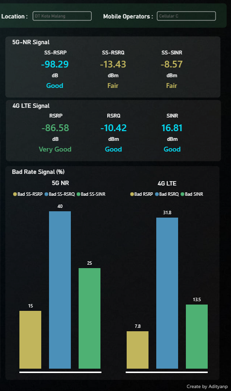
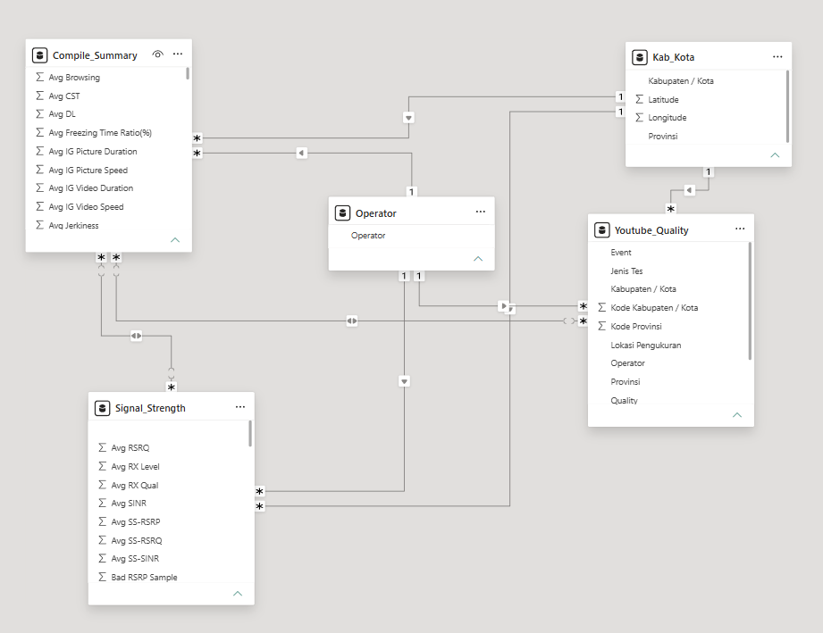

# 📡 Telecommunication Network Performance Dashboard

> A Power BI dashboard for analyzing mobile network performance based on Drive Test and User Experience measurement data.

## 📌 Project Overview

The **Telecommunication Network Performance Dashboard** is a Power BI project designed to provide an initial analysis of mobile network Quality of Service (QoS) and user experience measurement results across different locations and mobile operators.

The dashboard transforms Drive Test measurement data into interactive visualizations and analytical insights, allowing users to quickly evaluate network performance from multiple perspectives, including data throughput, radio signal conditions, voice call performance, and user experience.

The main purposes of this dashboard are to:

- Analyze the overall Quality of Service of a mobile network within a specific city or measurement area.
- Evaluate network performance based on Drive Test and User Experience test results.
- Provide an instant interpretation of the relationship between Speedtest performance and radio signal conditions.
- Compare 4G LTE and 5G NR signal penetration and quality.
- Evaluate social media and other user experience service performance at the measurement locations.

---

## 🎯 Analytical Objectives

This dashboard was developed to answer several key analytical questions:

- How is the overall mobile network performance in a particular city or measurement area?
- Are the measured download and upload speeds aligned with the observed radio signal conditions?
- Which network KPIs meet the expected performance categories and which require further investigation?
- How does the Voice Double Ended Call service perform at a specific measurement location?
- How do different mobile operators perform across the same or different measurement areas?

---

## 📊 Dashboard Preview


Additional views:







---

## 📈 Key Performance Indicators

The dashboard evaluates several network performance indicators across data, radio, and voice services.
- Data Performance: Download Speed, Upload Speed, Round Trip Time (RTT) / Latency
- 5G NR: SS-RSRP, SS-RSRQ, SS-SINR
- 4G LTE: RSRP, RSRQ, SINR
- Voice Call Performance: Success Call Rate, Blocked Call Rate, Dropped Call Rate, Mean Opinion Score (MOS), Call Setup Time (CST)

The KPI values are classified into several performance categories: `Very Good` | `Good` | `Fair` | `Bad`
These categories are used throughout the dashboard for visualization, conditional formatting, and dynamic analytical narratives.

---

## ✨ Key Features

The dashboard includes several interactive and analytical features:

- **Dynamic filtering by City / Regency**
- **Dynamic filtering by measurement location**
- **Dynamic filtering by Mobile Operator**
- **KPI performance classification**
  - Very Good
  - Good
  - Fair
  - Bad
- **Conditional color formatting** based on KPI performance
- **Dynamic narrative analysis using DAX**
- **Relationship-based interpretation between Speedtest and radio signal conditions**
- **Independent Voice Call performance analysis**
- **4G LTE and 5G NR performance comparison**
- Interactive dashboard behavior based on the selected measurement context

---

# 🧠 Dynamic Network Analysis

One of the main features of this dashboard is its **Dynamic Narrative Analysis**.

Instead of only displaying numerical KPI values, the dashboard evaluates multiple KPI categories and automatically generates an analytical summary based on the currently selected:

- City / Regency
- Measurement Location
- Mobile Operator

The narrative is generated dynamically using DAX measures.

## Data & Signal Analysis Logic

The analysis compares Speedtest results with the observed radio signal conditions.

### Scenario 1 — Good Speedtest + Acceptable Signal

When both download and upload performance are categorized as **Good or Very Good**, the dashboard checks whether the radio signal indicators also remain within acceptable categories.

If both conditions are aligned, the narrative indicates that the Speedtest performance is consistent with the observed radio conditions.

### Scenario 2 — Good Speedtest + Degraded Signal

If the Speedtest result remains **Good or Very Good** while one or more radio indicators are categorized as **Fair or Bad**, the dashboard highlights that the measured throughput remained strong despite the degraded radio condition.

This indicates that the observed signal condition did not significantly limit the measured throughput during that specific test.

### Scenario 3 — Poor Speedtest + Degraded Signal

If either download or upload performance is categorized as **Fair or Bad**, and degraded radio conditions are also detected, the dashboard identifies the radio environment as a **possible contributing factor** to the lower throughput.

The analysis does not automatically assume direct causation because throughput performance may also be influenced by other network conditions.

### Scenario 4 — Poor Speedtest + Acceptable Signal

When download or upload performance is categorized as **Fair or Bad**, but the radio signal indicators remain within acceptable categories, the analysis suggests investigating other possible factors such as:

- High user load
- Network congestion
- Radio resource scheduling
- Backhaul capacity
- Speedtest server performance
- Other network capacity-related conditions

---

## 📞 Voice Call Analysis Logic

Voice performance is analyzed separately from Speedtest performance.

The Voice Call analysis evaluates:

- Success Call Rate
- Blocked Call Rate
- Dropped Call Rate
- MOS
- Call Setup Time

When the Voice Call KPIs remain within acceptable categories, the dashboard provides an independent summary of the voice service performance.

However, if one or more Voice KPIs are categorized as **Fair or Bad**, the dashboard also evaluates the radio signal condition.

### Poor Voice KPI + Poor Signal

When degraded Voice KPIs occur together with degraded radio conditions, the narrative identifies the radio environment as a possible contributor to the observed Voice service degradation.

### Poor Voice KPI + Acceptable Signal

If Voice performance is degraded while radio conditions remain acceptable, the dashboard suggests that other factors may require further investigation, such as:

- Network congestion
- Call processing
- Mobility conditions
- Core network performance

> The narrative analysis is rule-based and is intended to provide an initial analytical indication rather than a definitive Root Cause Analysis (RCA).

---

# 🔄 Data Transformation

The source dataset is transformed using **Power Query** before being used in the Power BI data model.
Several transformation processes were implemented, including:
- Data cleaning
- Data type conversion
- Handling invalid and null values
- Column transformation
- Unpivoting selected KPI values
- Creation of reference tables
- Custom category sorting
- Preparation of datasets for specific dashboard visualizations

Reference tables were also created for specific analytical purposes, such as:

```text
Compile_Summary
      │
      ├── Signal_Strength
      │
      ├── Youtube_Quality
      │
      └── Other analytical reference tables
```

For example, video quality parameters stored in a wide format were transformed using **Unpivot Columns**, allowing the resolution categories to be analyzed dynamically within Power BI.

---

# 🗂️ Data Model

The dashboard uses a Power BI data model designed to support filtering and analysis across:

- Measurement Area
- City / Regency
- Mobile Operator


---

# 🧮 DAX Implementation

DAX measures are used extensively throughout the dashboard for:

- KPI aggregation
- KPI classification
- Dynamic conditional formatting
- Bad Rate calculations
- Dynamic narrative analysis
- Cross-KPI analytical interpretation

## Example — KPI Classification

The following measure categorizes LTE RSRP performance:

```DAX
RSRP Cat =
SWITCH(
    TRUE(),
    [Avg RSRP Meas] >= -92, "Very Good",
    [Avg RSRP Meas] >= -102, "Good",
    [Avg RSRP Meas] >= -105, "Fair",
    "Bad"
)
```

---

## Example — Dynamic KPI Color

The KPI category is reused to dynamically control the visualization color.

```DAX
RSRP Color =
SWITCH(
    [RSRP Cat],
    "Very Good", "#4EB173",
    "Good",      "#05DDF5",
    "Fair",      "#C1B55C",
    "Bad",       "#D64550",
    "#808080"
)
```

This approach allows the category logic to be defined once and reused by different dashboard components.

```text
KPI Measure
     │
     ▼
KPI Category
   ┌─┴──────────────┐
   ▼                ▼
Dynamic Color   Narrative Analysis
```

---

## Example — Dynamic Signal Narrative

The dashboard also constructs dynamic sentences based on the currently filtered network measurements.

```DAX
VAR SignalText =
    "The recorded signal indicators were SS-RSRP "
    & FORMAT(SSRSRP, "0.00")
    & " dBm (" & SSRSRPCat & "), SS-RSRQ "
    & FORMAT(SSRSRQ, "0.00")
    & " dB (" & SSRSRQCat & "), RSRP "
    & FORMAT(RSRP, "0.00")
    & " dBm (" & RSRPCat & "), and RSRQ "
    & FORMAT(RSRQ, "0.00")
    & " dB (" & RSRQCat & ")."
```

Because the narrative is generated from measures, the text automatically changes whenever the user changes the dashboard filters.

---

# 🛠️ Tools & Technologies

| Technology | Usage |
|---|---|
| **Microsoft Power BI** | Dashboard development and data visualization |
| **Power Query** | Data cleaning and transformation |
| **DAX** | KPI calculations, categorization, conditional formatting, and dynamic analysis |
| **Microsoft Excel** | Source data preparation |
| **Drive Test Data** | Mobile network performance measurement data |

---

# 🔍 Example Insights

The following example demonstrates how the dashboard can be used to analyze a measurement scenario.

### Measurement Scenario

| Parameter | Selection |
|---|---|
| City / Regency | Malang |
| Measurement Method / Location | DT Kota Malang |
| Mobile Operator | Cellular C |

### 1. Data Performance

The measured **download and upload speeds were both categorized as Very Good**, indicating strong data throughput performance during the Drive Test measurement.

### 2. Radio Signal Performance

The **4G LTE radio indicators remained within acceptable performance categories**, supporting the strong data throughput observed during the test.

The 5G NR measurements showed a different condition, where some signal quality indicators were categorized as **Fair**. Despite this, the overall Speedtest performance remained Very Good.

This indicates that the observed 5G radio quality condition did not significantly limit the measured throughput during the test.

### 3. Voice Call Performance

The Voice Double Ended Call test also demonstrated strong performance:

- **Success Call Rate:** 100%
- No blocked calls
- No dropped calls
- **MOS:** approximately 4.0
- Call Setup Time remained within a good performance category

These results indicate that the voice service performed reliably during the measurement.

### 4. Overall Assessment

Overall, the mobile Drive Test measurement for **Cellular C in DT Kota Malang, Malang** demonstrated **very good network performance**.

The data throughput and Voice Call services showed strong results, while the observed 5G signal quality provides an area that could be further evaluated despite not significantly affecting the measured Speedtest performance in this particular test.

---

# ⚠️ Limitations & Disclaimer

The dataset used in this portfolio project is **synthetically generated based on a predefined data template** designed to resemble the structure and characteristics of real Drive Test measurement data.

The dataset:

- Does **not** represent the actual performance of any real mobile network operator.
- Does **not** contain real customer information.
- Does **not** contain confidential operator measurement data.
- Should not be interpreted as representing the actual network condition of any specific operator, city, or measurement location.

Operator names, measurement results, locations, and performance values used in the portfolio may be anonymized, modified, or artificially generated for demonstration purposes.

The analytical narrative provided by the dashboard is **rule-based** and is intended for initial performance assessment. It should not be considered a replacement for comprehensive network troubleshooting or formal Root Cause Analysis.

---

# 📁 Repository Structure

The repository structure is planned as follows:

```text
telecommunication-network-performance-dashboard/
│
├── README.md
│
├── dashboard/
│   └── Telecommunication_Network_Performance.pbix
│
├── images/
│   ├── dashboard-overview.png
│   ├── data-signal-analysis.png
│   ├── voice-performance.png
│   └── data-model.png
│
└── sample-data/
    └── sample_dataset.xlsx
```

> Repository contents may be adjusted based on the final portfolio release.

---

# 🚀 Future Improvements

Potential improvements for future development include:

- Additional User Experience service analysis
- Social media performance analysis
- YouTube streaming quality analysis
- Browsing performance analysis
- More detailed 4G and 5G comparative analysis
- Geographic visualization of network performance
- Automated anomaly identification
- Additional dynamic network performance narratives
- More advanced cross-KPI analysis

---

## 👤 Author

**Aditya Nikolas Putra**

Data Analytics | Network Performance | Python Automation | Power BI

<!-- Add your links after publishing -->

- LinkedIn: `https://www.linkedin.com/in/adityanikolas`
- GitHub: `https://github.com/aditnikolas`

---

⭐ This project was developed as a portfolio project demonstrating the transformation of telecommunications measurement data into an interactive and analytical Power BI dashboard.